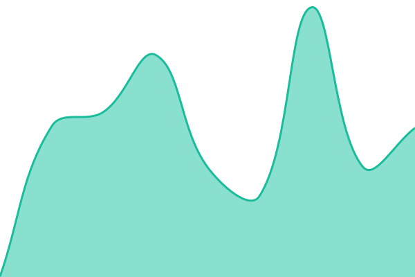
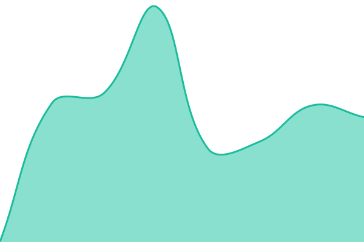
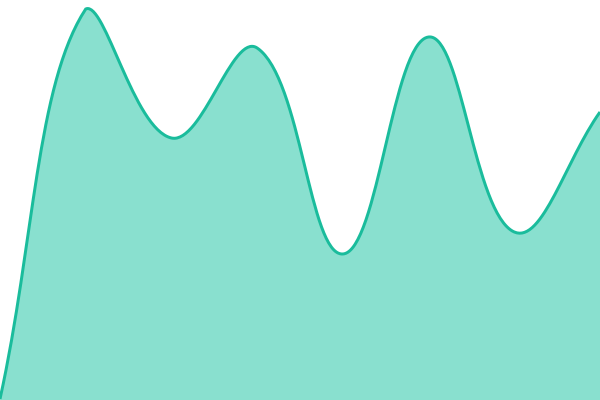

# [📈 Live Status](https://status.ioit.acm.org): <!--live status--> **🟩 All systems operational**

This repository contains the open-source uptime monitor and status page for [IOIT ACM Student Chapter](https://ioit.acm.org/), powered by [Upptime](https://github.com/upptime/upptime).

With [Upptime](https://upptime.js.org), you can get your own unlimited and free uptime monitor and status page, powered entirely by a GitHub repository. We use [Issues](https://github.com/IOIT-ACM/status/issues) as incident reports, [Actions](https://github.com/IOIT-ACM/status/actions) as uptime monitors, and [Pages](https://status.ioit.acm.org) for the status page.

<!--start: status pages-->
<!-- This summary is generated by Upptime (https://github.com/upptime/upptime) -->
<!-- Do not edit this manually, your changes will be overwritten -->
<!-- prettier-ignore -->
| URL | Status | History | Response Time | Uptime |
| --- | ------ | ------- | ------------- | ------ |
|  [IOIT ACM Official Website](https://ioit.acm.org) | 🟩 Up | [ioit-acm-official-website.yml](https://github.com/IOIT-ACM/status/commits/HEAD/history/ioit-acm-official-website.yml) | 

 397ms
     
 | 

<a href="https://status.ioit.acm.org/history/ioit-acm-official-website">99.45%</a>
    

|  [IOIT TENET Official Website](https://ioittenet.com) | 🟩 Up | [ioit-tenet-official-website.yml](https://github.com/IOIT-ACM/status/commits/HEAD/history/ioit-tenet-official-website.yml) | 

 410ms
     
 | 

<a href="https://status.ioit.acm.org/history/ioit-tenet-official-website">100.00%</a>
    

|  [IOIT MUN Official Website](https://mun.ioittenet.com) | 🟩 Up | [ioit-mun-official-website.yml](https://github.com/IOIT-ACM/status/commits/HEAD/history/ioit-mun-official-website.yml) | 

 355ms
     
 | 

<a href="https://status.ioit.acm.org/history/ioit-mun-official-website">100.00%</a>
    

|  [IOIT ACM Link Shortener](https://links.ioit.acm.org) | 🟩 Up | [ioit-acm-link-shortener.yml](https://github.com/IOIT-ACM/status/commits/HEAD/history/ioit-acm-link-shortener.yml) | 

 258ms
     
 | 

<a href="https://status.ioit.acm.org/history/ioit-acm-link-shortener">100.00%</a>
    

|  [IOIT ACM ChapterOS](https://os.ioit.acm.org) | 🟩 Up | [ioit-acm-chapter-os.yml](https://github.com/IOIT-ACM/status/commits/HEAD/history/ioit-acm-chapter-os.yml) | 

 985ms
     
 | 

<a href="https://status.ioit.acm.org/history/ioit-acm-chapter-os">100.00%</a>
    

|  [IOIT ACM Hackathon](https://hack.ioittenet.com) | 🟩 Up | [ioit-acm-hackathon.yml](https://github.com/IOIT-ACM/status/commits/HEAD/history/ioit-acm-hackathon.yml) | 

 340ms
     
 | 

<a href="https://status.ioit.acm.org/history/ioit-acm-hackathon">100.00%</a>
    

|  [IOIT ACM Youth Parliament](https://yp.ioit.acm.org) | 🟩 Up | [ioit-acm-youth-parliament.yml](https://github.com/IOIT-ACM/status/commits/HEAD/history/ioit-acm-youth-parliament.yml) | 

 249ms
     
 | 

<a href="https://status.ioit.acm.org/history/ioit-acm-youth-parliament">100.00%</a>
    

<!--end: status pages-->

[**Visit our status website →**](https://status.ioit.acm.org)

## 📄 License

- Powered by: [Upptime](https://github.com/upptime/upptime)
- Code: [MIT](./LICENSE) © [Anand Chowdhary](https://anandchowdhary.com)
- Data in the `./history` directory: [Open Database License](https://opendatacommons.org/licenses/odbl/1-0/)
